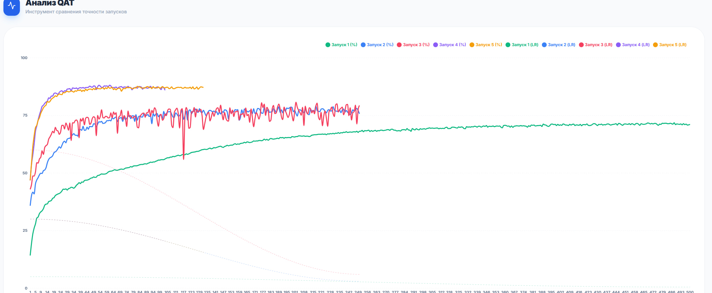

# 🔒 PPNN (Privacy-Preserving Neural Network)

**A fully homomorphic neural network built from scratch in Rust.**

<div align="center">

<!-- DEMO VIDEO -->
<video src="https://github.com/user-attachments/assets/a878c12a-7e6b-4b02-b662-cae0a6c319fa" controls="controls" style="max-width: 700px;">
</video>

<br/>

<!-- QAT ANALYSIS GRAPH -->
<h3>📊 QAT Training Analysis</h3>


<div align="left" style="max-width: 700px; margin: 0 auto;">
<p>
    <b>Training Efficiency Comparison (Quantization Aware Training):</b>
</p>
<ul>
    <li>🟢 <b>Green</b>: Training on mixed dataset (My Assets + Fonts). Slow convergence.</li>
    <li>🔴 <b>Red</b> (LR=0.03) & 🔵 <b>Blue</b> (LR=0.06): Training on the same mixed dataset, but with increased Learning Rate. Reaches plateau faster.</li>
    <li>🟡 <b>Yellow</b> (LR=0.03) & 🟣 <b>Purple</b> (LR=0.06): Mode <code>train_only_my</code>. Training <b>only</b> on user dataset. Instant convergence and high accuracy for specific handwriting.</li>
</ul>
</div>

<br/>

<!-- ARCHITECTURE DIAGRAM -->


</div>

---

**PPNN** is a complete implementation (from scratch, in Rust) of a handwritten digit recognition system running over Fully Homomorphic Encryption (FHE).

The server **never** sees the digit you drew. It receives encrypted pixels, performs computations (matrix multiplication + activation via bootstrapping) and returns an encrypted result. Only you (the client in the browser) can decrypt the answer.

---

## 🏗 Architecture and Security

The project implements the **TFHE (Torus FHE)** scheme with programmable bootstrapping.

### Implementation Details
In this demo version, the server technically **has access** to the private key (it is generated at server start), however **all computations (inference)** on user data are performed strictly in encrypted form using homomorphic operations (addition, multiplication by constant, bootstrapping). 

The server does not "peek" at data during computations, but performs mathematical operations on "noise", which turns into a meaningful answer only after decryption on the client.

### Components
1.  **LWE Crypto Engine**: Custom implementation in Rust (`src/lwe.rs`, `src/bootstrap.rs`).
2.  **Neural Network**: Two-layer network trained on `f64` and quantized to `u64`.
3.  **Collector**: Tool for creating your own dataset (`static/collector.html`).

---

## 🚀 Usage

The project is fully ready to work "out of the box" — model weights are already in the repository (`model_weights.json`).

### 1. Quick Start (Inference)
Start the server with the ready model:
```bash
cargo run --release -- serve
```
Open `http://localhost:3000` in the browser. Draw digits, and the server will guess them in encrypted form.

### 2. Collecting Your Own Dataset
Want the network to recognize your specific handwriting?
1. Open the file `static/collector.html` in any browser (just drag and drop the file or use Live Server).
2. Draw digits in the square.
3. Press a digit on the keyboard (0-9) to save a sample.
4. Data is saved to the `static/my_assets/` folder.

### 3. Training on Your Data
After collecting the dataset, run the special training mode:
```bash
cargo run --release -- train_only_my
```
This retrains the model **only** on your collected examples (very fast) and overwrites `model_weights.json`. After that, restart the server (`serve`) to apply the new model.

### 4. Full Training
If you need to retrain the network from scratch on a combination of system fonts and your data:
```bash
cargo run --release -- train
```

---

## 🛠 Technical Details (Solutions & Fixes)

*   **Rust**: Core logic, multithreading (`rayon`), HTTP server (`axum`).
*   **TFHE/LWE**: Full custom implementation of crypto logic.
*   **BigInt**: Client-side cryptography in pure JavaScript.
*   **Neural Network**: Custom `Vec<f64>` / `Vec<u64>` implementation (no Torch/TensorFlow dependencies).
